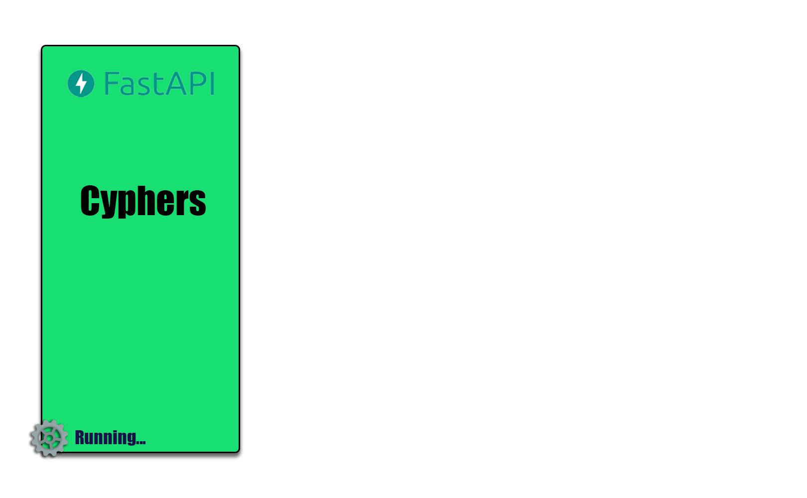
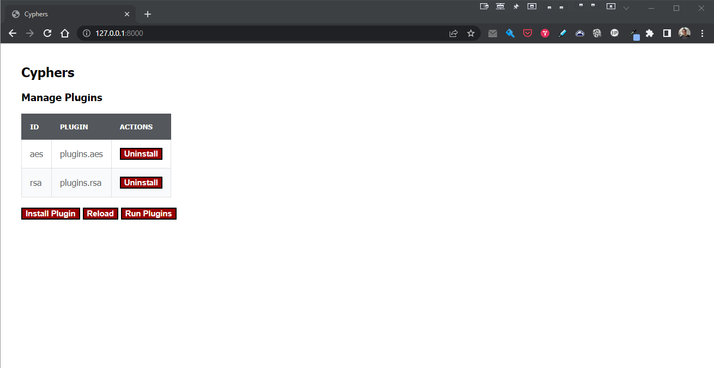

# **A Plugin Architecture Sample in Python**
A simple example of a python plugin architecture. 

This is a very simple (*dumb*) application, with only the necessary, to see and prove a plugin architecture in python. It also serves as a sandbox to try out future ideas (continuous improvements).

The application has a list of Cyphers that are installed in the format of Plugins. It allows to add new Cyphers Plugins during runtime and make them avaible to run right away.




## **Quick Start**
```bash
poetry shell
poetry install
make run
# Go to...
http://localhost:8000
```

Launch the application, and try to add one of the plugins available at the folder `./plugins_not_installed`.



---
## **Plugin - Interface** 

 

The interface definition of a Cypher Plugin it's specificed by the class Cypher:

```python
from typing import Protocol
from abc import abstractmethod

class Cypher(Protocol):

    @abstractmethod
    def algorithm(self) -> str:
        raise NotImplementedError
    
    def encrypt(self, word: str) -> str:
        """Encrypt a value"""
    
    def decrypt(self, word: str) -> str:
        """Descrypt a value"""
```
In order to create a new Plugin, we need to make sure that our new Cypher (a Python class) follow this interface above. Also, we need to provide one extra method, that's part of the Plugin Interface:

```python
class PluginInterface:
    """Represents a plugin interface"""

    @staticmethod
    def register(factory_register) -> str:
        """Register this plugin in our factory of plugins"""
```
This is necessary so the application receive some information about the Plugin that is going to be register (as part of it).

---

## **Plugin - Implementation**


Here an example of how should be created a new Cypher Plugin:

```python
# Unique Id of this Plugin
PLUGIN_CYPHER_KEY = "twofish"

@dataclass
class TwoFish:

    block_size: int
    
    def encrypt(self, word: str) -> str:
        # Do the TwoFish encryption here
        encrypted = word + " Not implemented yet"
        return base64.b64encode(encrypted).decode()
    
    def decrypt(self, word: str) -> str:
        return "NotImplemented"

    def algorithm(self) -> str:
        return "TwoFish"

def register(factory_register) -> str:
    factory_register(PLUGIN_CYPHER_KEY, TwoFish)
    log.info(f"Registered plugin {PLUGIN_CYPHER_KEY}: {__name__}")
    return PLUGIN_CYPHER_KEY

def default_init_parameters() -> Dict[str,Any]:
    return {
      "type": PLUGIN_CYPHER_KEY,
      "block_size": 32,
    }
```
Upload this file, and if everything works well, this should be listed as another cypher option available to be run.

## **Notice!**
This project is the status of "ongoing", to improvements, ideas, fixing, etc...   in other words, working in progress.